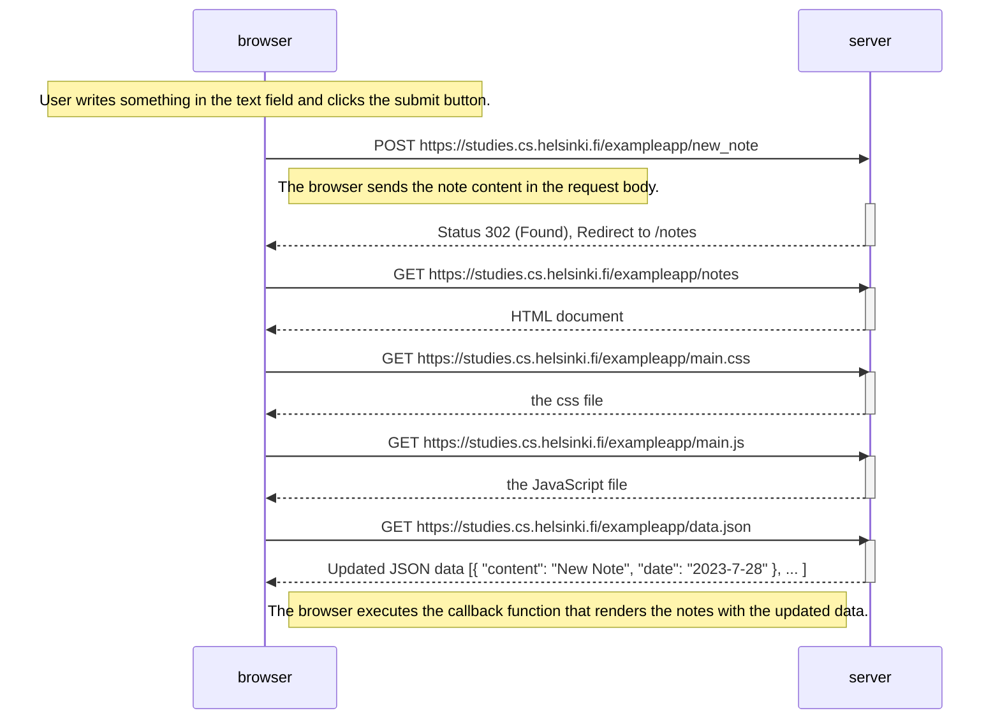

# New note diagram 0.4

```mermaid

sequenceDiagram
    participant browser
    participant server

    Note over browser: User writes something in the text field and clicks the submit button.

    browser->>server: POST https://studies.cs.helsinki.fi/exampleapp/new_note
    Note right of browser: The browser sends the note content in the request body.
    activate server
    server-->>browser: Status 302 (Found), Redirect to /notes
    deactivate server

    browser->>server: GET https://studies.cs.helsinki.fi/exampleapp/notes
    activate server
    server-->>browser: HTML document
    deactivate server

    browser->>server: GET https://studies.cs.helsinki.fi/exampleapp/main.css
    activate server
    server-->>browser: the css file
    deactivate server

    browser->>server: GET https://studies.cs.helsinki.fi/exampleapp/main.js
    activate server
    server-->>browser: the JavaScript file
    deactivate server

    browser->>server: GET https://studies.cs.helsinki.fi/exampleapp/data.json
    activate server
    server-->>browser: Updated JSON data [{ "content": "New Note", "date": "2023-7-28" }, ... ]
    deactivate server

    Note right of browser: The browser executes the callback function that renders the notes with the updated data.

```
