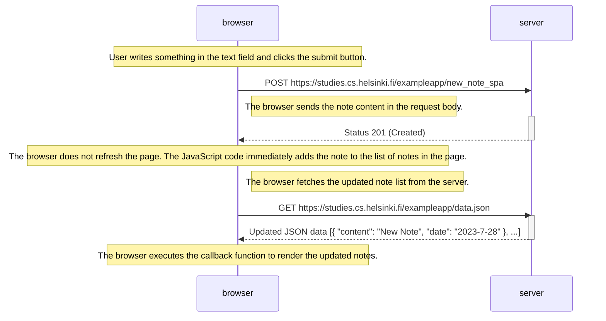

# New note in Single page app diagram 0.6

```mermaid

sequenceDiagram
    participant browser
    participant server

    Note over browser: User writes something in the text field and clicks the submit button.

    browser->>server: POST https://studies.cs.helsinki.fi/exampleapp/new_note_spa
    Note right of browser: The browser sends the note content in the request body.
    activate server
    server-->>browser: Status 201 (Created)
    deactivate server

    Note over browser: The browser does not refresh the page. The JavaScript code immediately adds the note to the list of notes in the page.

    Note right of browser: The browser fetches the updated note list from the server.

    browser->>server: GET https://studies.cs.helsinki.fi/exampleapp/data.json
    activate server
    server-->>browser: Updated JSON data [{ "content": "New Note", "date": "2023-7-28" }, ...]
    deactivate server

    Note over browser: The browser executes the callback function to render the updated notes.
```
